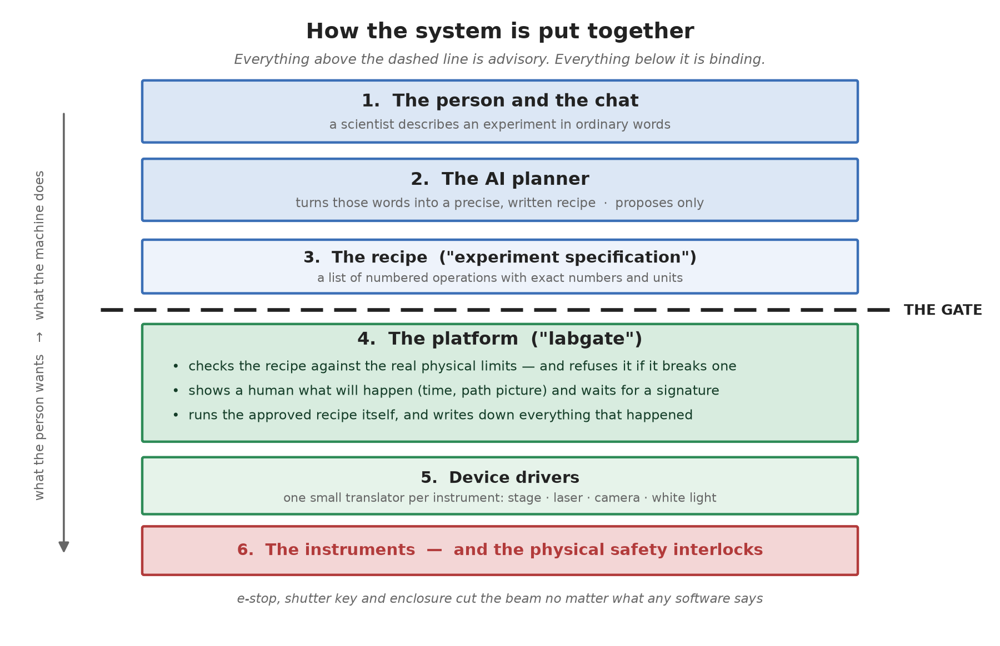
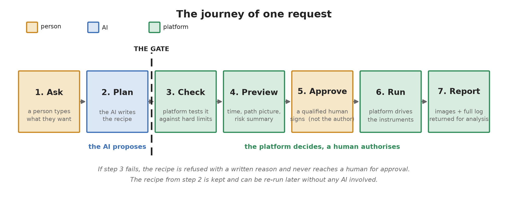
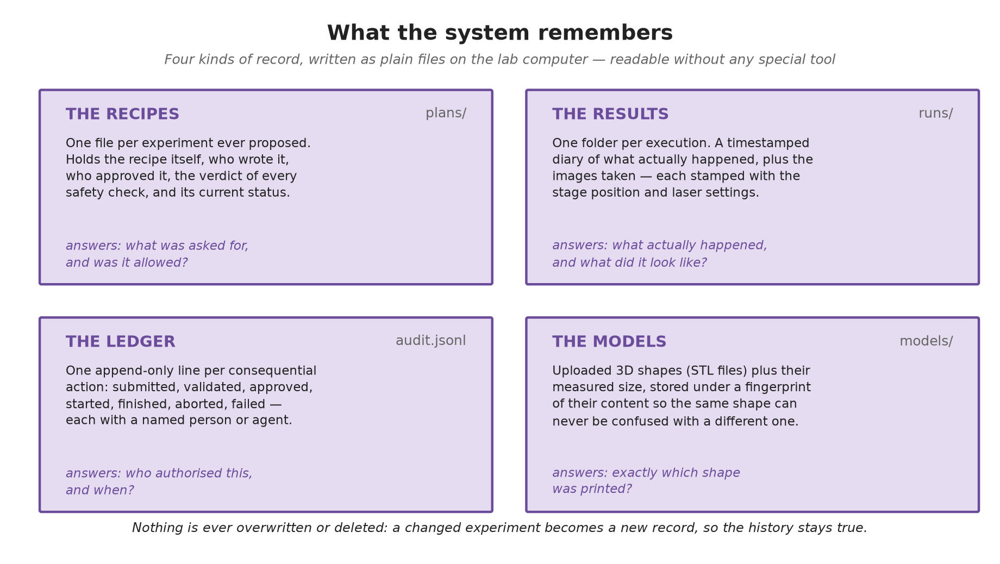

# 1.  What this system is

A scientist should be able to say *"print me a test grid at 25 % power and photograph it"* and have that happen on a real femtosecond laser rig — without writing code, and without any chance that a misunderstood sentence damages the sample, the optics, or a person.

Those two goals pull in opposite directions. Language is loose; a laser is not. The whole design is the answer to that tension, and it comes down to a single rule:

> **The AI proposes. A separate, deterministic layer disposes.** The AI writes down what it thinks should happen. A piece of ordinary, testable software — no AI in it — then decides whether that is allowed, shows a human what it would do, waits for a signature, and only then drives the instruments itself.

Everything else in this document is a consequence of that sentence.

The software that does the deciding is called **labgate**. It is the "API Gate" in the architecture the team has been discussing.

# 2.  How the system is put together

{5.95}

Read it top to bottom. A request starts as human intent and ends as motion.

The dashed line is the important part. Above it, everything is **advice**: a person's words, an AI's interpretation, a proposed recipe. Any of it can be wrong. Below it, everything is **authority**: fixed limits, recorded decisions, real motors.

The four things worth understanding about that line:

- **Nothing crosses it except a written recipe.** The AI never sends code, never sends a command, and never holds a connection to an instrument. It sends a document describing what it wants.
- **The recipe is checked as if a stranger wrote it.** The platform does not care that an AI produced it. It applies the same limits it would apply to a recipe typed by hand.
- **A human authorises every physical run.** And, deliberately, it cannot be the same person or agent that proposed it.
- **The bottom layer is not software at all.** The e-stop, the shutter key and the enclosure interlock cut the beam regardless of what any program believes. Software is the second line of defence; those are the first.

# 3.  The journey of one request

{6.5}

**1 — Ask.** Someone types a sentence into the chat.

**2 — Plan.** The AI first asks the platform what this rig can actually do — which instruments exist, which operations they support, and what the hard limits are. It then writes a recipe using only that vocabulary. It cannot invent an operation, because it is composing from a list the platform published a moment earlier.

**3 — Check.** The platform tests the recipe against physical reality: is every power, speed and coordinate inside the permitted range; is the laser configured before it is asked to fire; is the white light off while the beam is on. A single hard failure refuses the whole recipe, and the refusal comes with a written reason.

**4 — Preview.** For a recipe that passes, the platform works out how long it will take, how far the stage will travel, how many times the beam will open, and draws a picture of the actual path. This is what a human is asked to look at.

**5 — Approve.** A qualified person reviews that and signs. The platform records who. If the signer is the same identity that proposed the recipe, it is refused.

**6 — Run.** The platform — not the AI — drives the instruments, one experiment at a time, writing down every step as it goes. It can be stopped mid-run.

**7 — Report.** Images and a complete log go back. The AI reads those and explains the outcome to the scientist, and the conversation continues.

> A refused recipe never reaches step 5. A human is never asked to approve something the platform has already determined is unsafe — which means an approval click always means something.

# 4.  What the system remembers

People often ask "what does the database look like?". The honest answer is that there is no database server. There is a folder on the lab computer holding four kinds of plain file.

{6.2}

That choice is deliberate. One rig runs one experiment at a time, so there is no crowd of simultaneous writers to coordinate — the classic reason to reach for a database engine simply does not apply here. Plain files survive a power cut, can be read years from now in any text editor, need nobody to administer them, and can be backed up by copying a folder.

Three properties matter more than the storage technology:

- **Nothing is ever overwritten.** A modified experiment becomes a new record; the old one stays as it was. The history of what was actually authorised cannot be edited after the fact.
- **Every consequential action names a person or agent.** Not "the system approved this" — a name, and a timestamp, in an append-only ledger.
- **The recipe is kept separately from what happened.** One file says what was asked for and permitted; another says what actually occurred. Comparing them is how you investigate a surprise.

If the lab ever outgrows this — several rigs on one platform, or questions asked across thousands of past runs — the code is already arranged so that swapping in a real database means rewriting three small classes and nothing else.

# 5.  What can and cannot happen

These are the guarantees the design is built to provide. Each is enforced by code and covered by automated tests, not by convention or care.

| It cannot happen that… | Because… |
| --- | --- |
| the AI drives an instrument directly | the AI's only channel is a request over the network; the platform owns every device connection |
| a recipe exceeding a hard limit runs | the checker runs on every submission, before a human is ever asked |
| someone approves their own proposal | the approval step compares the two identities and refuses if they match |
| an unapproved plan starts | the run engine refuses any plan not in the approved state |
| a fault leaves the beam on | every ending — success, fault, abort — runs the same closing sequence, laser first |
| two experiments collide on the rig | one worker thread executes; everything else queues in order |
| a run happens with nobody accountable | every state change appends a line naming the actor |

And the honest converse — what the platform does **not** claim:

- It cannot stop a *physically valid but scientifically pointless* experiment. Judging whether an experiment is worth doing remains the scientist's job; the platform only judges whether it is permitted.
- It cannot protect against wrong limits. If the configured maximum power is wrong, the checker will enforce the wrong number faithfully. Those limits need a named owner who signs off on them.
- It is not the last line of defence. The hardware interlocks are.

# 6.  Where the project actually stands

**Working today**, tested and running in simulation on any computer:

- The full platform: recipe format, checker, approval lifecycle, execution engine, results and audit trail.
- Ten operation types, including parameter sweeps, 2PP threshold ladders, and 3D printing from an uploaded STL model.
- The complete natural-language loop, demonstrated end to end: a plain-English request became a recipe, was checked, previewed, approved by a second identity, executed, and returned an image — while an unsafe request ("150 % power at x = 40 mm") was refused with specific reasons and never became approvable.
- Two independent adversarial code reviews, which found and fixed 43 defects — including two ways the laser could have been left on after a fault in the pre-existing lab code.

**Not yet done**, and each blocked on something specific:

| Remaining work | Waiting on |
| --- | --- |
| camera and white-light drivers | the SDK documentation for those two units |
| first run on the real rig | scheduled access, plus two hardware checks flagged in the code |
| speed calibration at 1 and 3 mm/s | rig access (a measurement, not a code change) |
| connection to the chat platform | how user identity is passed through, and the network route to the rig |

The engineering runway is clear. What remains is mostly conversations and a day on the instrument.
