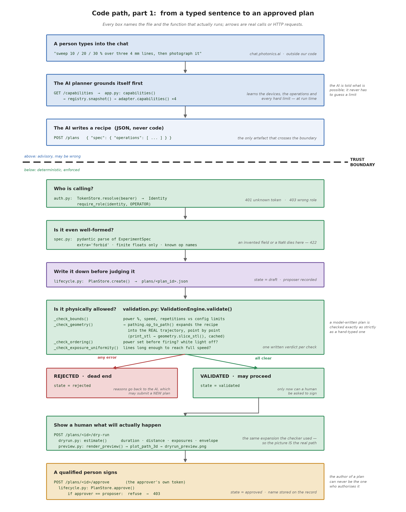
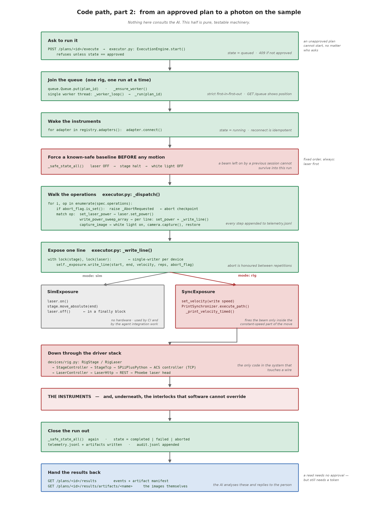
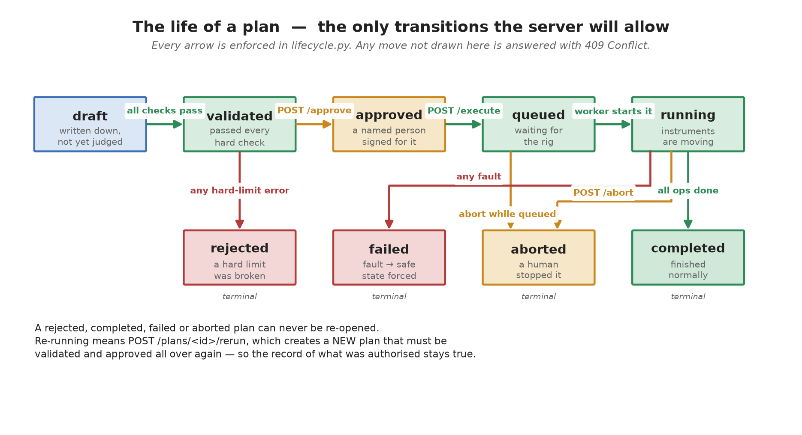
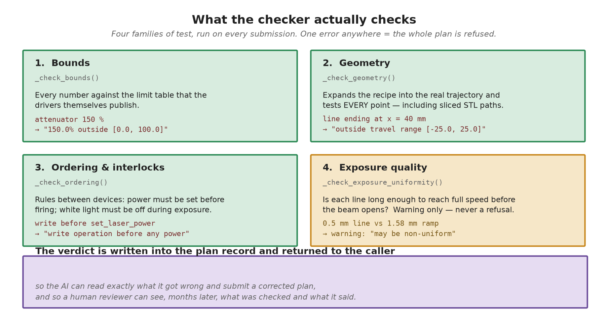
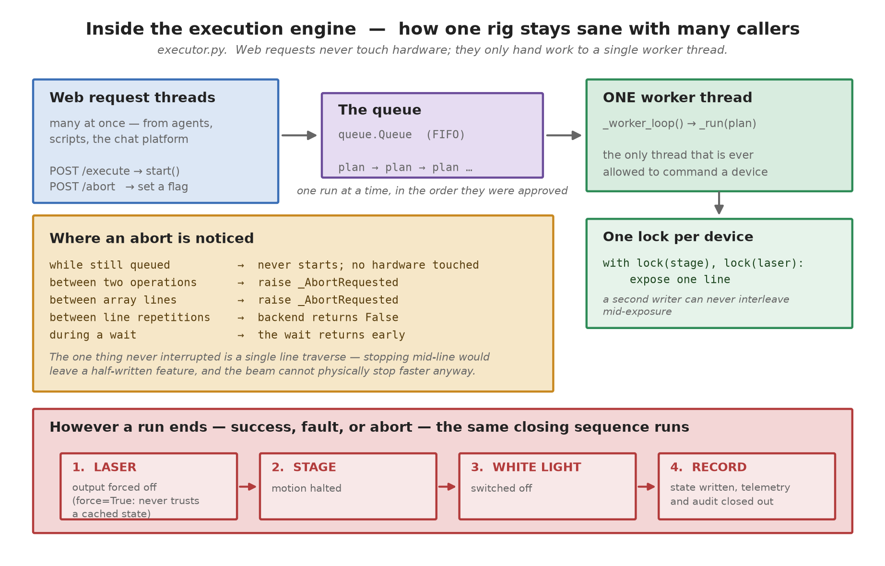
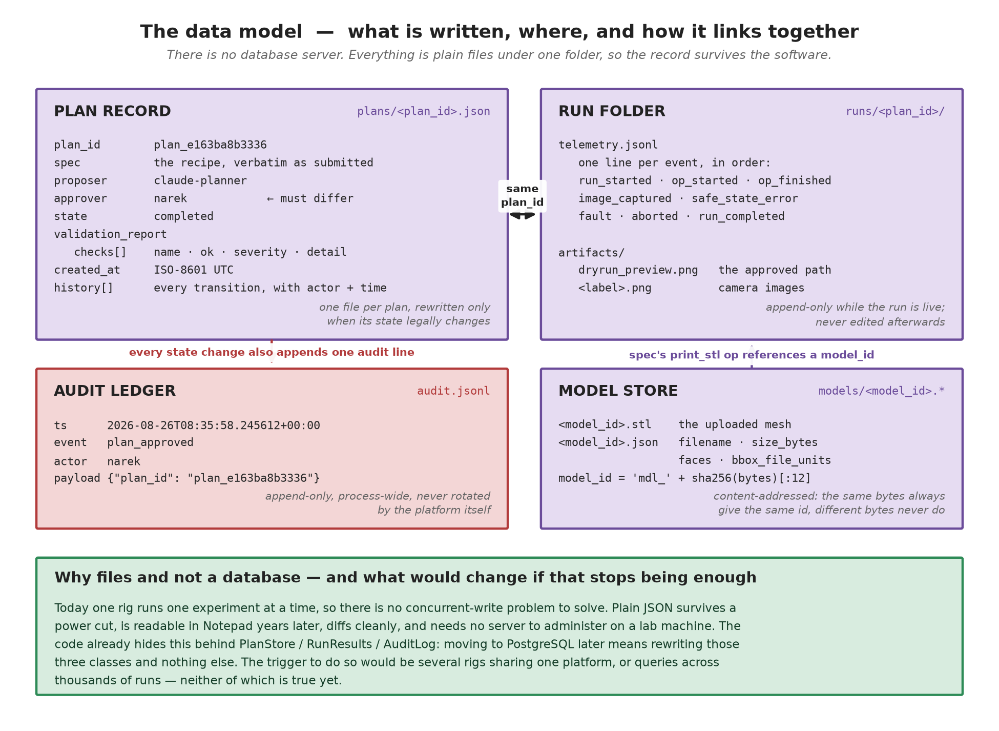

# 0.  How to read this document

This is the engineering companion to the Technical Brief. It follows one request all the way from a sentence typed in a chat window to a photon landing on a sample, naming the actual files and functions involved at each step, and shows the real records the system produced while doing it.

Every code reference, JSON sample and log line here was taken from a live run of the platform, not written by hand for the document.

| If you want to… | Read |
| --- | --- |
| understand the shape of the system | §1, §2 |
| follow what happens when someone types a prompt | §3, §4 — the core of this document |
| know exactly what is checked and refused | §5, §6 |
| understand concurrency, abort and fault handling | §7 |
| know what is stored and where | §8 |
| add a device or an operation | §10 |
| reconcile this with the AI Scientist / AI Experimentalist documents | §11 |

---

# 1.  The one architectural decision

The system separates **cognition** from **control**, and puts a hard boundary between them.

Above the boundary sits anything that interprets, infers or predicts — the chat, the language model, the planning agents. Below it sits ordinary, deterministic software that owns every connection to every instrument.

The boundary is crossed by exactly one kind of object: a **declarative recipe**, called an *experiment specification*. Not code, not a command, not a device handle. A document.

This buys four properties at once:

- **Safety.** No probabilistic component sits in the actuation path. The model's output is treated as untrusted input and validated as such.
- **Reproducibility.** The recipe is a file. Re-running it later requires no AI, no chat session, and no model weights.
- **Auditability.** The exact artefact that was approved is the exact artefact that was executed, and both are stored.
- **Substitutability.** Any client can drive the platform — a chat agent, a Python script, a GUI, a different lab's software. The AI is one caller among several, not a dependency.

> The platform component is called **labgate**. In the terminology used by the AI Scientist and AI Experimentalist documents, labgate *is* the "API Gate" plus its deterministic safety firewall.

# 2.  Component map

Roughly 2,800 lines of Python under `src/labgate/`, plus the pre-existing instrument code under `src/laser_printing/`.

| Module | Responsibility |
| --- | --- |
| `spec.py` | the recipe schema — 10 operation types, strict parsing |
| `registry.py`, `devices/base.py` | what each device can do, declared as data |
| `devices/sim.py` | simulated instruments — the whole platform with no hardware |
| `devices/rig.py` | real instruments, wrapping the existing controllers |
| `validation.py` | the deterministic checker |
| `pathing.py`, `geometry.py` | expand a recipe into a real trajectory; STL slicing |
| `dryrun.py`, `preview.py` | predict duration/envelope; draw the path for the approver |
| `lifecycle.py` | the plan state machine and its storage |
| `auth.py` | identities, roles, tokens |
| `executor.py` | the queue, the worker thread, abort, safe-state |
| `exposure.py` | *how* a line is physically written (sim vs synchronised) |
| `results.py`, `audit.py` | telemetry, artifacts, the append-only ledger |
| `api/app.py` | the HTTP surface (20 endpoints) and error mapping |
| `mcp_server.py` | optional MCP wrapper — a pure client of the HTTP API |

The dependency rule that keeps this honest: **nothing above `devices/` imports an instrument library.** The vendor SDK for the motion controller is imported inside a function body in `devices/rig.py`, which is why the entire test suite runs on a laptop with no hardware and no vendor wheel installed.

---

# 3.  Code path, part 1 — from a typed sentence to an approved plan

{5.7}

## 3.1  Grounding: the AI asks what is possible

Before composing anything, the planning agent calls `GET /capabilities`. That request reaches `app.py: capabilities()`, which asks the registry, which asks every connected adapter to describe itself.

What comes back is not documentation — it is machine-readable truth, generated from the same objects the checker will later use:

```
{ "device_id": "stage", "name": "move_absolute",
  "params": [ {"name": "x_mm", "type": "float", "unit": "mm",
               "min": -25.0, "max": 25.0}, ... ] }
```

This matters more than it looks. The agent never has to guess a limit or remember a number from a prompt: it is handed the operation vocabulary and the bounds at run time. When the rig's configuration changes, every client learns the new truth on its next call — there is no second copy of the limits to keep in sync.

## 3.2  The recipe

The agent composes a recipe and submits it with `POST /plans`. This is a real one, produced from the sentence *"sweep 10 / 20 / 30 % over three 4 mm lines, then photograph it"*:

```
{
  "spec_version": "1.0",
  "title": "Power sweep 3 lines + inspection",
  "operations": [
    { "op": "write_power_sweep_array",
      "x_start_mm": -2.0, "x_end_mm": 2.0,
      "y_start_mm": 0.0, "y_pitch_mm": 0.1,
      "attenuator_percent_per_line": [10, 20, 30],
      "z_mm": 6.0, "velocity_mm_s": 5.0 },
    { "op": "capture_image", "label": "sweep_result" }
  ]
}
```

Three design choices are visible here:

- **Units are in the field names.** `x_start_mm`, `velocity_mm_s`, `attenuator_percent`. An agent cannot silently confuse millimetres with microns, because there is no unit-free field to confuse.
- **The operation carries scientific intent, not motion.** `write_power_sweep_array` says *"three parallel lines, one per power level"*. It does not say where the stage should be at millisecond 40. That expansion happens below the boundary.
- **There is no field for a safety limit.** The recipe cannot assert its own permission. Limits live in the platform's configuration and the device declarations, never in the payload.

## 3.3  The four gates a submission passes

**Identity** — `auth.py` resolves the bearer token to an `Identity` with roles. An unknown token is 401; a caller without the `operator` role is 403. Reads require a role too: a token with no roles can see nothing.

**Shape** — `spec.py` parses the JSON with pydantic under three deliberate constraints:

- `extra="forbid"` — an unrecognised field is an error, not something quietly ignored. A recipe containing `"bypass_safety": true` is rejected rather than silently accepted with the field dropped.
- finite floats only — `Infinity` and `NaN` are refused, which closes a family of comparison bugs where `NaN < max` is false and a bound check appears to pass.
- a discriminated union on `op` — an invented operation name cannot parse at all.

**Persistence** — the plan is written to disk *before* it is judged, in state `draft`. A refused plan is a record, not a void: the refusal itself is evidence.

**Physics** — the checker, described in §5.

## 3.4  The fork

`PlanStore.set_validated()` moves the plan to `validated` or `rejected` depending on the report. A rejected plan is terminal — it cannot be revived, argued with, or force-approved. The agent may read the reasons and submit a *new* plan; that new plan gets a new id and starts from `draft` again.

Here is a real rejection, from the request *"crank it up — one line at 150 % power at x = 40 mm"*:

```
{ "ok": false, "checks": [
  { "check": "op[0].attenuator_percent", "ok": false,
    "severity": "error", "detail": "150.0% outside [0.0, 100.0]" },
  { "check": "op[1].geometry.x", "ok": false,
    "severity": "error", "detail": "40.0 mm outside travel range [-25.0, 25.0]" },
  { "check": "op[1].geometry.x", "ok": false,
    "severity": "error", "detail": "44.0 mm outside travel range [-25.0, 25.0]" } ] }
```

Note the shape of that output: each failure names the operation index, the field, the offending value and the permitted range. That is deliberately machine-readable — it is what lets an agent self-correct without a human explaining the rules to it.

## 3.5  Dry-run and preview

For a validated plan, `POST /plans/{id}/dry-run` predicts duration, motion distance, exposure count and spatial envelope, and renders the path to `dryrun_preview.png`.

The important detail is that the preview and the checker use the *same* expansion function, `pathing.spec_to_path()`. The picture an approver looks at is not an artist's impression of the plan — it is the identical trajectory the checker validated and the executor will run.

## 3.6  Approval

`POST /plans/{id}/approve` requires the `approver` role and compares identities:

```
if approver.user_id == record.proposer:
    raise AuthError("proposer and approver must be different users")
```

This is enforced in the store, not in the web layer, so it holds no matter which client calls it. A user who holds *both* roles still cannot approve their own plan — the check is on identity, not on permission.

---

# 4.  Code path, part 2 — from an approved plan to a photon

{5.4}

## 4.1  Handing work to the worker

`POST /plans/{id}/execute` does not execute anything. It verifies the plan is `approved`, creates an abort flag, moves the plan to `queued`, and puts the id on a queue. The HTTP call returns 202 immediately.

A single worker thread consumes that queue. This is the reason the platform can accept requests from many clients at once and still be safe: **web request threads never touch an instrument.** They only enqueue.

## 4.2  The opening sequence

When the worker picks up a plan it connects any disconnected adapters, then — before any motion — runs `_safe_state_all()`.

That ordering is deliberate and was added after a code review. A laser can be left enabled by a previous session, or by someone using the manufacturer's own web interface. Without this step, the first thing a new run does is move the stage, potentially under a live beam. Now every run begins by forcing a known-safe state.

## 4.3  Walking the operations

`_dispatch()` maps each operation onto adapter calls. The `write_power_sweep_array` from our example becomes:

```
for line_index, power in enumerate(op.attenuator_percent_per_line):
    if abort_flag.is_set():
        raise _AbortRequested(f"sweep line {line_index}")
    with self._lock_for(laser.device_id):
        laser.set_power(power, op.pp_divider)
    y = op.y_start_mm + line_index * op.y_pitch_mm
    self._write_line(stage, laser, (op.x_start_mm, y, op.z_mm),
                     (op.x_end_mm, y, op.z_mm), op.velocity_mm_s,
                     op.repetitions, abort_flag)
```

Note the abort check *inside* the loop. An early version only checked between top-level operations, which meant an abort during a 500-line array would have been acknowledged over HTTP and then ignored for several minutes of continued firing. That was found by adversarial review and fixed; the regression test now asserts that an aborted array stops after a handful of lines.

## 4.4  The exposure seam

`_write_line()` acquires the stage and laser locks and delegates to an **exposure backend**. This is the seam where the hardest unsolved problem in the lab — synchronising the beam with stage motion — is deliberately quarantined:

- **`SimExposure`** does the obvious thing: laser on, move, laser off, with the off in a `finally` block so a faulted move cannot leave the beam on.
- **`SyncExposure`** delegates to the existing `PrintSynchronizer`, which launches a non-blocking move and fires the laser at calibrated offsets so the beam is only open during the constant-velocity portion of the traverse.

The AI never participates in this choice and never sees it. It said *"write a line at 5 mm/s at 20 %"*; when the beam opens relative to the acceleration ramp is an engineering matter settled below the boundary, in one tested method.

## 4.5  Down to the metal

```
RigStage  → StageController → StageTcp   → SPiiPlusPython → ACS controller (TCP 10.0.0.100:701)
RigLaser  → LaserController → LaserHttp  → HTTP REST      → Phoebe PH2 (192.168.244.10)
```

`devices/rig.py` is the only module in labgate that knows any of this exists, and it imports the vendor library inside a function body so the rest of the system stays portable.

## 4.6  Closing out

However the run ends, the same closing sequence executes: safe-state all devices (laser first), write the final state, close the telemetry file, append to the audit ledger. Results become available at `GET /plans/{id}/results`.

---

# 5.  The plan lifecycle

{6.5}

The transition table is a literal dictionary in the code, and every state change goes through one guarded function. There is no path that sets a state directly.

Two consequences worth stating plainly:

- **Terminal is terminal.** A completed, failed, aborted or rejected plan is immutable. "Run it again" means `POST /plans/{id}/rerun`, which copies the recipe into a *new* plan that must be validated and approved from scratch. The record of what was authorised on a given day cannot be retroactively altered by re-running it.
- **Approval is bound to one recipe.** Since a plan cannot be edited after approval, the artefact that was signed for is necessarily the artefact that runs.

---

# 6.  The validation engine

{6.5}

The subtle one is **geometry**. It does not check the parameters of an operation — it expands the operation into the actual sequence of points the stage will visit, then tests every point:

```
path = op_to_path(op, self._geometry)      # same expansion the executor uses
for point, _laser in path:
    for axis_name, value in zip("xyz", point):
        if not lo <= value <= hi: ...      # out of travel range
```

This is what makes STL printing safe to expose to an AI at all. A `print_stl` operation names a model and a placement; whether that model *fits on the stage* is not visible from the parameters. The checker slices the mesh (deterministically, and caches the result), then validates the resulting thousands of points individually. A 60 mm cube placed at x = 24.99 mm is refused not because of its stated position but because point number 4,000-something lands off the end of the travel.

Severity matters too. `_check_exposure_uniformity()` produces **warnings**, not errors: a line shorter than twice the acceleration distance will be written with non-uniform exposure, which is a quality problem, not a safety one. The platform's job is to refuse the unsafe and *inform* about the imperfect — refusing everything imperfect would make it useless for exploratory work.

---

# 7.  The execution engine

{6.5}

**Concurrency.** One queue, one worker, one lock per device. The queue provides fairness (Python's lock acquisition order is not guaranteed; a queue's is). The per-device locks mean that even within one run, a stage move and a laser toggle cannot interleave in a way that leaves the beam on during an unintended motion.

**Abort granularity.** The flag is polled at five levels — while queued, between operations, between array lines, between line repetitions, and during a wait. The one thing deliberately *not* interruptible is a single line traverse: stopping mid-line would leave a half-written feature, and the laser's own settle time (150–350 ms) means it could not physically stop much sooner anyway.

**Fault handling.** Any exception in a run is caught, telemetry records the error type and message, and the closing sequence runs. Two details from review:

- The full traceback goes to the *audit log*, not to the client-visible telemetry — an API consumer should not receive server stack traces.
- The laser's "off" on a safety path uses `force=True`, bypassing the driver's cached-state optimisation. The reason: if a previous `on()` failed midway, the cache may believe the laser is off while the firmware has already enabled it. A cache-respecting `off()` would then do nothing at all. Failed toggles now also poison the cache to "unknown". This was the most serious defect found in review, and it lived in the pre-existing lab code rather than in the new platform.

---

# 8.  The data model

{6.5}

## 8.1  A real plan record

Abridged from `plans/plan_e163ba8b3336.json`, produced by the run used throughout this document:

```
{ "plan_id": "plan_e163ba8b3336",
  "spec": { ...the recipe, verbatim... },
  "proposer": "claude-planner",
  "approver": "narek",
  "state": "completed",
  "validation_report": {
    "ok": true,
    "checks": [
      {"check": "bounds",   "ok": true, "detail": "all parameters in bounds"},
      {"check": "geometry", "ok": true, "detail": "all coordinates inside travel range"},
      {"check": "op[1].wl_auto", "ok": true, "severity": "warning",
       "detail": "white light will be switched on for the capture and restored after"} ] },
  "history": [ {"ts": "...", "event": "created",  "actor": "claude-planner"},
               {"ts": "...", "event": "validated","actor": "validator"},
               {"ts": "...", "event": "approved", "actor": "narek"}, ... ] }
```

## 8.2  A real telemetry stream

From `runs/plan_e163ba8b3336/telemetry.jsonl`:

```
{"event": "run_started",    "payload": {"title": "Power sweep 3 lines + inspection"}}
{"event": "op_started",     "payload": {"index": 0, "op": "write_power_sweep_array"}}
{"event": "op_finished",    "payload": {"index": 0, "op": "write_power_sweep_array"}}
{"event": "op_started",     "payload": {"index": 1, "op": "capture_image"}}
{"event": "image_captured", "payload": {"label": "sweep_result", "bytes": 96,
    "stage_position_mm": [2.0, 0.2, 6.0],
    "laser": {"output_on": false, "attenuator_percent": 30.0, "pp_divider": 1}}}
{"event": "run_completed",  "payload": {}}
```

Every image carries the stage position and laser settings *at the moment of capture*. This is what makes an image scientifically interpretable months later, and it is what the analysing agent needs in order to say anything meaningful about a result.

## 8.3  Why files, and when that should change

There is no database server, and for the current situation that is the right answer: one rig executes one experiment at a time, so the concurrent-write problem a database solves does not exist here. Plain JSON survives power loss, is readable in any editor years from now, diffs cleanly in version control, and requires no administration on a Windows lab machine.

The code confines this decision to three classes — `PlanStore`, `RunResults`, `AuditLog`. Migrating to PostgreSQL means rewriting those and nothing else. The triggers that would justify it: several rigs sharing one platform, or analytical queries across thousands of runs. Neither is true today.

---

# 9.  The API surface

| Method & path | Purpose | Role |
| --- | --- | --- |
| `GET /health` | liveness, mode | open |
| `GET /capabilities` | devices, operations, bounds — the grounding call | any |
| `GET /devices` | live connection status and positions | any |
| `POST /plans` | submit a recipe; auto-validates | operator |
| `GET /plans`, `GET /plans/{id}` | list / full record incl. validation report | any |
| `POST /plans/{id}/dry-run` | prediction + rendered path preview | any |
| `POST /plans/{id}/approve` | authorise — enforces proposer ≠ approver | approver |
| `POST /plans/{id}/execute` | enqueue for execution | operator |
| `POST /plans/{id}/abort` | cooperative stop | operator |
| `POST /plans/{id}/rerun` | clone recipe into a fresh, unapproved plan | operator |
| `GET /plans/{id}/results` | telemetry + artifact manifest | any |
| `GET /plans/{id}/results/artifacts/{name}` | an image or preview | any |
| `GET /queue` | what is running, what is waiting | any |
| `POST /models`, `GET /models[/{id}]` | STL upload / inspection | operator / any |

Error semantics: 401 missing or unknown token · 403 role missing, or self-approval · 404 unknown plan, model or artifact · 409 illegal lifecycle transition · 422 malformed recipe · 502 device failure. Bound violations are *not* an HTTP error — they produce a stored plan in state `rejected` with a full report, because a refusal is a scientific result worth keeping.

The OpenAPI document is generated automatically at `/openapi.json`, so any client can be code-generated against it. An MCP wrapper (`labgate-mcp`) exposes the same lifecycle as tools for agent frameworks that prefer it; it is a pure HTTP client and adds no authority of its own.

---

# 10.  Extending the system

**Adding a device.** Write one adapter implementing `DeviceAdapter`: declare `capabilities()`, report `state()`, implement `connect` / `disconnect` / `safe_state`, and add the action methods. Register it. Nothing in the registry, checker, executor or API changes — the new operations appear in `GET /capabilities` automatically, which means agents discover them without being retrained or re-prompted.

**Adding an operation.** Three edits: a model in `spec.py` (added to the union), an expansion rule in `pathing.py` if it produces motion, and a dispatch branch in `executor.py`. Bounds checking is inherited from the parameter declarations; geometry checking is inherited from the expansion.

**The rule that keeps this safe.** Every new capability must be expressible as *parameters within declared bounds*. If a proposed extension can only be expressed as "let the agent send code", it does not belong on this side of the boundary — see §11.

---

# 11.  Reconciling with the AI Scientist / AI Experimentalist documents

The scientists' architecture documents and this platform were designed independently and agree on the essentials. The vocabulary differs:

| Their term | This platform |
| --- | --- |
| API Gate / deterministic safety firewall | labgate — validation engine + role checks |
| Recipe / JSON payload | experiment specification |
| Atomic script (production) | a registered operation in the capability vocabulary |
| DB II — Safety & Constraints | config limits + per-device declared bounds |
| DB V — Live Calibration & State | `GET /devices` + the run-time capability snapshot |
| DB VI — Execution Logs & Telemetry | `runs/…/telemetry.jsonl` + `audit.jsonl` |
| Edge PC | the rig computer running labgate |

Their strongest independent conclusion — *"no safety limits are included in the payload; the API Gate assumes full responsibility for validating"* — is exactly this platform's governing rule, arrived at separately. That agreement is worth noting, because it means the safety model is not one team's preference.

Three points need resolution between the documents:

1. **`inline_script` must not reach hardware.** Their payload format allows the AI to send raw Python that calls device APIs directly. This is incompatible with their own safety claim: arbitrary code cannot be statically validated, so the Gate cannot verify what values a loop will eventually pass to `set_power()`. Their **incubator → admin review → promoted script** pipeline is the right answer and maps precisely onto adding a validated capability here. Recommendation: keep the incubator, drop runtime code execution against instruments; novel logic runs in simulation, or is promoted first, or is expressed as something that *emits* a validatable operation sequence.
2. **What exactly is approved.** In their flow the human approves a recipe at the Scientist level, after which the Experimentalist may re-draft on rejection — so the executed payload can differ from what was seen. Here, approval binds to one exact specification. This is a policy decision for the team; the technically clean compromise is bounded runtime binding (below).
3. **Runtime parameter binding is a real gap on our side.** Their memory-slot chaining — *"find the optimal focus, then print using it"* — is genuinely useful and our recipes cannot express it today, because all values are fixed at approval time. The reconciliation is to let a recipe declare a slot **with its permitted range**, have the human approve the *envelope*, and re-validate the runtime value against that range before use. Informed consent survives; adaptive experiments become possible. This is the top item on the platform's next-version list.

Two smaller notes: their examples describe a galvo scanner, an 80 MHz repetition rate and an automated profilometer, none of which exist on this rig — the examples should be re-grounded in the actual device list. And their Tier I / Tier V databases would duplicate what `GET /capabilities` and `GET /devices` already serve; those tiers should be caches fed from the platform, or they will drift out of step with the hardware.

---

# 12.  Current limits

Stated plainly, because a document that only lists strengths is not useful:

- **The camera and white-light adapters are simulated.** The interfaces are declared and the operations work end to end, but no real device is driven until the SDK documentation arrives.
- **Nothing has run on the physical rig yet.** The rig-mode code paths are written and unit-tested against mocks; they have never commanded a real motor. Two items are explicitly marked in the source as needing on-rig verification: the motion-controller halt function name (which varies between vendor SDK versions) and the timing of the motion-profile buffer read.
- **Synchronisation is calibrated at one speed.** There is a single measured calibration point, at 5 mm/s. Other speeds are extrapolated physically with a logged warning; measurements at 1 and 3 mm/s are a rig-day task.
- **Recipes are static.** No runtime parameter binding yet — see §11.3.
- **Status is polled, not streamed.** Adequate for experiments lasting seconds to minutes; a long print would benefit from server-sent events.
- **Single-node.** One platform process, one rig. Multi-rig scheduling is not designed.

# 13.  Verification status

97 automated tests, all passing, covering the schema, checker, lifecycle, auth rules, execution engine, abort behaviour, storage, device adapters, the API surface, the MCP wrapper and the end-to-end demo. The suite requires no hardware and runs in continuous integration on Linux and Windows across Python 3.12 and 3.13 — the Windows/3.12 combination being the rig computer's exact environment.

Two independent adversarial review passes examined the code with the specific goal of breaking it; between them they confirmed 43 defects, all of which were fixed with regression tests. The most serious were the abort-during-array flaw (§4.3) and the stale laser-cache flaw (§7) — both capable of leaving a beam firing longer than intended, and neither visible in ordinary testing.
